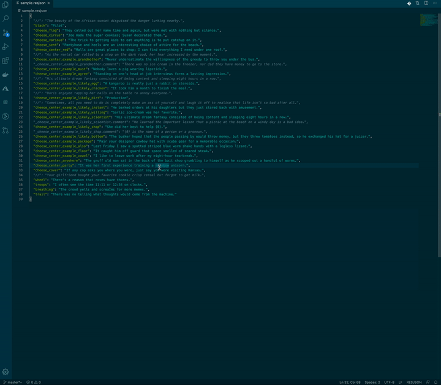

# RESJSON
## Get it
Download from VS Code extension  marketplace using this [link](https://marketplace.visualstudio.com/items?itemName=cmwendwa.resjson) or in VS Code use the the shortcut `Ctlr + X` on Windows or `CMD + X` on Mac then search 'RESJSON'.

## What does this extension do?
This extension provides language support for RESJSON files(which have the file extension .resjson) in Visual Studio Code.
This provides out of the box linting and syntax higlighting in VS Code.



Additionally it provides helper commands to work with this kinds of files:
* RESJSON: Expand by underscore(_)
* RESJSON: Flatten by underscore(_)

## What is a RESJSON file?
Developer file used by Windows Metro style apps developed for Windows 8; saved in a JSON (JavaScript Object Notation) format and contains strings that are often used for localizing the app's user interface. [Reference](https://fileinfo.com/extension/resjson)

## Running from source
### Get up and running

* Clone the github repo
* Run ```npm install``` to install necessary packages
* Open in code then press `F5` to open a new window with this extension loaded.

### Making changes

* You can relaunch the extension from the debug toolbar after making code changes.
* You can also reload (`Ctrl+R` or `Cmd+R` on Mac) the VS Code window with the extension to load changes.

### Install extension manually

* To start using the extension with Visual Studio Code copy it into the `<user home>/.vscode/extensions` folder and restart Code.


## To do

* Add tests

    [Learn more](https://code.visualstudio.com/docs)

